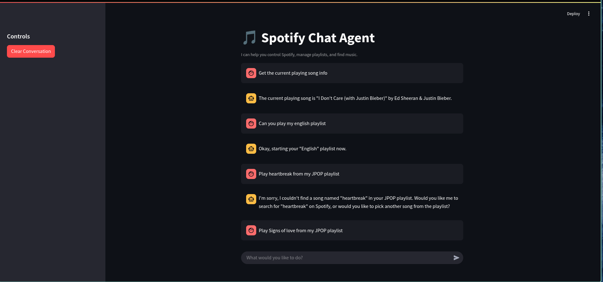

# Spotify Agentic Controller

A powerful agent-powered controller for Spotify built using the [Model Context Protocol (MCP)](https://github.com/modelcontextprotocol/mcp).  
This project allows you to use natural language to control Spotify — play songs, manage playlists, get track info, and more — all through an intelligent agent interface.

## Features

This agent uses `spotify-mcp-server` under the hood and can perform the following actions:

-  Start, pause, or skip playback
-  Search for tracks, albums, artists, or playlists
-  Get detailed info about a track, album, artist, or playlist
-  Manage and view your Spotify queue
-  Create, update, or manage your playlists

---

## Configuration & Setup

### 1. Get Spotify API Keys

To connect your Spotify account:

1. Go to [developer.spotify.com](https://developer.spotify.com)
2. Log in and navigate to the **Dashboard**
3. Create a new app
4. Set the `Redirect URI` as:  
   `http://127.0.0.1:8080/callback`  
   (You can use any port, but **must use HTTP and localhost/127.0.0.1**)

Keep your **Client ID** and **Client Secret** safe — you'll need them later.

---

### 2. Clone the Repository

Clone the `spotify-mcp` repo locally:

```bash
git clone https://github.com/varunneal/spotify-mcp.git
cd spotify-mcp
```

Make sure you have Node.js installed (>=18) since this repo uses npx.

### 3. Run the Spotify MCP Server (Only for first time)
From inside the cloned repo directory:

```bash
npx @modelcontextprotocol/inspector uv --directory . run spotify-mcp
```

This will start the MCP server inspector.Press the connect button,then go to tools and then press list tools. This will open up a set of tools.Press any tool - for this case, let's consider using the tool 'SpotifyQueue'. Here, there are 2 actions - add or get. Type get and press run tool. This will open the authentication window for spotify.


### 4. Authenticate Your Spotify Account

- It will redirect you to Spotify for login/authorization.
- Tokens will be saved locally and reused for future sessions.

---
## How to Run the Spotify Agent

Once you've completed the authentication and setup steps:

### 1. Install Python Requirements

```bash
pip install -r requirements.txt
```

## Run the Agent Interface

```bash
streamlit run spotify-agent-final.py
```

This will launch a chat-style web interface using Streamlit with memory where you can interact with the agent.

## Example Agent Capabilities

Here are some things you can say to the agent:

- "Pause the music" → Pauses playback  
- "Play my chill playlist" → Finds a playlist you created and plays it  
- "Add Blinding Lights to Gym Mix" → Searches and adds the song  
- "Create a playlist called Vibes" → Makes a new playlist  
- "What’s playing right now?" → Gets the current track  
- "Tell me about the album After Hours" → Fetches detailed info  
- "Play Blinding Lights from my Workout playlist" → Queues playlist, adds song again, and skips to it  

---

## Agent Behavior Notes

- If a song is requested **from a playlist**, the agent:
  - Queues the entire playlist
  - Adds the requested song again
  - Skips to that song
  - But only **if the song exists in that playlist** — otherwise, it **pauses** and asks the user
- When user says *"my playlists"*, the agent prioritizes playlists owned by the user (`jawahar`)
- Agents automatically resolve vague inputs by searching and confirming actions

---

## Built With

- [spotify-mcp-server](https://github.com/varunneal/spotify-mcp)
- [Model Context Protocol](https://modelcontext.org)
- [Agno Framework](https://github.com/varunneal/agno)
- Google Gemini API

---

## Future Ideas

- Voice input for real-time control  
- Smart playlist recommendations via LLMs 

---

## Preview

  
## License

This project is open-sourced under the Apache-2.0 License.
